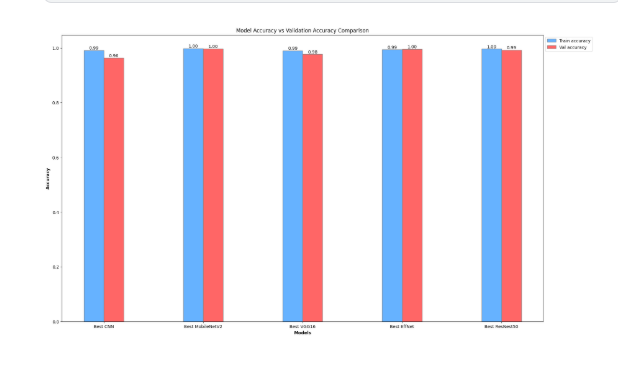

# 🧪 Lung and Colon Cancer Classification using Deep Learning

[](LICENSE)
[]()
[]()

## 📌 Project Overview
This project focuses on **classifying histopathological images** of lung and colon tissues into **five classes** using various deep learning architectures.  
The dataset is taken from [Kaggle - Multi Cancer Dataset](https://www.kaggle.com/datasets/obulisainaren/multi-cancer) and contains high-resolution microscopic images.

The models implemented include:
- ✅ Custom CNN
- ✅ VGG16 (Transfer Learning)
- ✅ ResNet50V2 (Transfer Learning)
- ✅ MobileNetV2 (Transfer Learning)
- ✅ EfficientNetB0 (Transfer Learning)

The performance of all models is compared to determine the best-performing architecture.

---

## 📂 Dataset Description
The dataset contains five labeled classes:

| Class Name   | Description |
|--------------|-------------|
| `colon_aca`  | Colon adenocarcinoma (malignant tumor) |
| `colon_bnt`  | Benign colon tissue |
| `lung_aca`   | Lung adenocarcinoma |
| `lung_bnt`   | Benign lung tissue |
| `lung_scc`   | Lung squamous cell carcinoma |


---

## ⚙️ Workflow
1. **Data Loading** from KaggleHub dataset.
2. **Data Visualization** – Display random samples from each class.
3. **Data Preprocessing** – Resize images to `224x224`, normalize pixels, one-hot encode labels.
4. **Train-Validation-Test Split** – 70% training, 15% validation, 15% testing.
5. **Model Training**:
   - Custom CNN
   - Transfer Learning (VGG16, ResNet50V2, MobileNetV2, EfficientNetB0)
6. **Evaluation** – Accuracy, Precision, Recall, Loss plots.
7. **Model Comparison** – Validation Accuracy & Loss across all models.
8. **Confusion Matrix** – For performance analysis.

## 📈 Results

### Model Accuracy Comparison
This bar chart shows training vs validation accuracy for all models. MobileNetV2 achieved perfect validation accuracy in this run.



*Figure: Comparison of train and validation accuracy for the evaluated architectures (Custom CNN, MobileNetV2, VGG16, EfficientNetB0, ResNet50V2).*


## 🚀 How to Run

### 1️⃣ Clone the repository
```bash
git clone https://github.com/your-username/lung-colon-cancer-classification.git
cd lung-colon-cancer-classification


## 🛠 Requirements
Install dependencies:
```bash
pip install tensorflow numpy pandas matplotlib opencv-python scikit-learn tqdm plotly kagglehub

